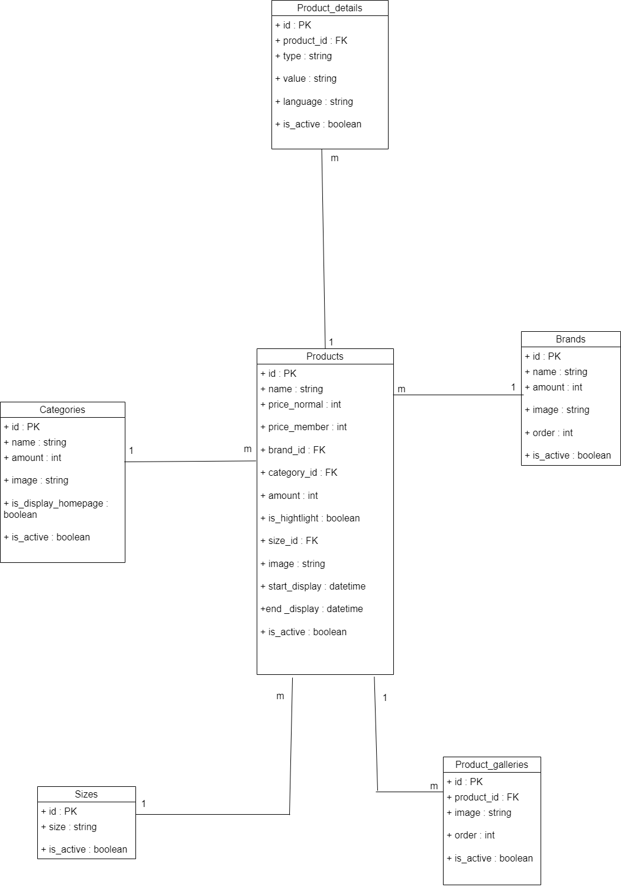

# Basic Ecommerce
------------------------------------------------
#### Pavisa Sirirojvorakul | Student_ID : 6310620064
---------------------------------------------------
#### Basic Ecommerce พัฒนาโดยใช้ Laravel Framework 
### แบ่งการทำงานออกเป็น 2 ส่วน คือ Admin และ User
---------------------------------------------------
### Admin 
- Category
- Brand
- Size
- Product
    - Detail
    - Gallery
#### สามารถ CREATE READ UPDATE DELETE ได้ทั้งหมดสำหรับทุกๆส่วน เลือกได้ว่าจะให้ส่วนใดแสดงหน้าเว็บไซต์บ้าง

------------------------------------------------------------------------------------------------------
### User
- เลือกดู Category
- เลือกดู Brand
- เลือกดู Size
- เลือกดู Product
- เลือกดู Popular Product
------------------------------------------------------------------------------------------------------
### Diagram

{width=300 height=200}  
